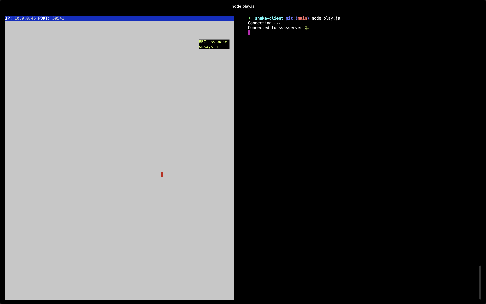

# Snake Client Project

This project was created and published by me (@rebeccaariss) as part of my studies at Lighthouse Labs.

Snake game is a very popular video game. It is a video game concept where the player maneuvers a dot and grows it by "eating" pieces of food. As it moves and eats, it grows and the growing snake becomes an obstacle to smooth manoeuvres. The goal is to grow it to become as big as possible without bumping into the side walls, or bumping into itself, upon which it dies.

This is simply a multiplayer take on the genre.

Before you can run this client, you will need to be running the server side which you can download and install from here. 

## 👩🏼‍💻 Final Product

*You should see this in your terminal upon connection to the server*

*Preview of the message that prints with "H" keypress*

## 🕹️ Getting Started

- Follow steps inside the snek server repo to run the server side
- I would highly recommend splitting your terminal window so that you can run the server on one side with `npm run play` and run this project's files on the other side
- Run the development snake client using the `node play.js` command.

## 🐍 Snake Key Controls
* `W`:  Move up
* `A`:  Move left
* `S`:  Move down
* `D`:  Move right

### 💬 Customized messages:
Press the following keys to trigger some fun messages from your snake 😜
* `H`:  Salutation
* `J`:  Observation
* `K`:  Lamentation